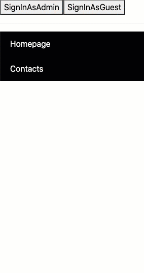

# ANGULAR TRAINING: CREAZIONE MENU DINAMICO



# APIS:

* [API: /loginAsGuest, /loginAsAdmin, /menu](https://my-json-server.typicode.com/training-api/dynamic-menu)

* GET: allowed
* POST, PUT, PATCH DELETE: allowed (but fake 200 response. Changes are not persistent)

---


## ESERCIZIO

### CREA UN NUOVO PROGETTO

Crea un nuovo progetto Angular, installa Bootstrap come dipendenza (configura `angular.json` per far in modo che sia disponibile globalmente) e avvia il progetto.

> Non è necessario utilizzare il router in questa applicazione

---

### ESERCIZIO 1: Creazione menu dinamico

In `AppComponent` carica i dati dall'API REST `/menu`:

* [https://my-json-server.typicode.com/training-api/dynamic-menu/menu](https://my-json-server.typicode.com/training-api/dynamic-menu/menu)

> Dovrai ovviamente creare un custom type `Menu` che ti sarà utile per tipizzare il tuo codice.


### Crea il componente

Crea un componente `<app-super-menu>`:

```
ng g c core/components/super-menu --flat
```

che utilizzerai, in `AppComponent` come illustrato di seguito:

```javascript
<app-super-menu [data]="menu" userRole="admin"></app-super-menu>
```

### Menu dinamico

Crea ora dinamicamente il menu modificando il componente `<app-super-menu>` che hai creato nello step precedente.

**Dovrai gestire al massimo due livelli di menu: quindi item principali e sub-items.**

**In questa fase non è necessario tener conto dei ruoli. Visualizza tutti gli item e i sub-items**

Per comprendere la struttura che dovrà avere questo menu ti consiglio di visualizzare la response del servizio REST [/menu](https://my-json-server.typicode.com/training-api/dynamic-menu/menu) e dare un'occhiata alla preview della demo (che trovi all'inizio di questa pagina).

Per il CSS puoi usare Bootstrap (o quello che preferisci) e di seguito trovi la struttura HTML statica (che ovviamente dovrai rendere dinamica):

```html
<ul class="list-group list-group-flush">
  <li class="list-group-item">Cras justo odio</li>
  <li class="list-group-item">
    <ul class="list-group list-group-flush">
      <li class="list-group-item">Cras justo odio</li>
      <li class="list-group-item">Dapibus ac facilisis in</li>
      <li class="list-group-item">Morbi leo risus</li>
      <li class="list-group-item">Porta ac consectetur ac</li>
      <li class="list-group-item">Vestibulum at eros</li>
    </ul>
  </li>
  <li class="list-group-item">Morbi leo risus</li>
  <li class="list-group-item">Porta ac consectetur ac</li>
  <li class="list-group-item">Vestibulum at eros</li>
</ul>
```

---

### ESERCIZIO 2: Styling

Applica ai menu items il colore del font e del background che ricevi dall'API `/menu`.

 
---

### ESERCIZIO 3: Gestione Ruoli e Permessi
Al momento, visto che ancora non hai realizzato il login (allo scopo di acquisire il ruolo dell'utente), puoi simulare diversi scenari passando al componente un ruolo hard-coded, `admin` o `guest`, in modo da poter verificare velocemente il funzionamento di entrambi gli scenari.

Nell'esempio seguente il primo menu simula lo scenario in cui l'utente loggato sia un `admin`. Il secondo simula uno scenario in cui l'utente è `guest`:

```javascript
<app-super-menu [data]="menu" userRole="admin"></app-super-menu>
<app-super-menu [data]="menu" userRole="guest"></app-super-menu>
```

#### Regole di visualizzazione:

Ogni item ha uno specifico ruolo (`role`) che rappresenta la tipologia di utenti che possono visualizzarli:

Se l'item `role` è:

* `admin`: solo gli utenti loggati con ruolo `admin` possono visualizzarli
* `guest`: possono essere visualizzati dagli utenti con ruolo `guest` o `admin`
* `public`: se un item ha come ruolo `public` potrà essere visualizzato da tutti, anche da utenti non loggati.

---

### ESERCIZIO 4: Gestione Azioni
Il componente `<app-super-menu>` dovrebbe emettere un evento custom `itemClick` quando l'utente clicca su un menu item che dovrà passare, come parametro, le informazioni sull'azione: azione e parametri.
 
In questo modo, quando si utilizzerà questo componente in varie applicazioni e/o contesti, si potrà decidere di gestire le azioni in modo differente.

Ad esempio, se al click abbiamo un `action` di tipo `router` puoi reindirizzare l'utente alla route passata come parametro. Oppure, all'azione `openURL` potrai aprire un link esterno e così via.

Di seguito un esempio di utilizzo dell'evento `tabClick`:

```javascript
<app-super-menu 
  [data]="menu" 
  userRole="admin"
  (itemClick)="doSomething($event)"
></app-super-menu>
``` 

Nell'esempio di codice precedente, che illustra come dovrebbe essere utilizzato il componente, la funzione `doSomething` riceverà l'azione nel seguente formato:

```javascript
{
  action: string,
  params: string  
}
```

Ad esempio:

```javascript
{ action: 'openUrl', params: 'http://www.google.com' }
```

oppure:

```javascript
{ action: 'router', params: 'admin' }
```

#### Quindi? Cosa fare con l'azione ricevuta?

Ai fini dell'esercizio è sufficiente ricevere le informazioni sull'azione (tipologia di azione e parametri) ed effettuare un semplice `console.log` (o un `alert`) per verificare che arrivino tutte le informazioni per poterla gestire.
Se hai tempo (e voglia 😀 ) puoi comunque gestire il cambio di route oppure usare `window.open(url)` per aprire un link esterno al click di un item.

Oppure puoi anche provare a configurare un `json-server` per creare un server locale e aggiungere altre azioni e livelli di permissi


---

### ESERCIZIO 5: GESTIONE LOGIN

Aggiungere due pulsanti per simulare il login come `guest` e come `admin` allo scopo di simulare un login (vedi preview del risultato finale all'inizio di questo documento).


Puoi usare due diverse API per simulare il login come 'guest' o 'admin':
 
* [https://my-json-server.typicode.com/training-api/dynamic-menu/loginAsAdmin](https://my-json-server.typicode.com/training-api/dynamic-menu/loginAsAdmin)
* [https://my-json-server.typicode.com/training-api/dynamic-menu/loginAsGuest](https://my-json-server.typicode.com/training-api/dynamic-menu/loginAsGuest)


> Non è necessario passare credenziali o gestire token. Sarà sufficiente invocare l'endpoint per il login e far in modo che il menu visualizzi i suoi menu-item sulla base del ruolo utente: public, guest or admin.

Guarda il paragrafo "Gestione Ruoli" per una spiegazione su come devono essere applicate le regole di visualizzazione per i singoli menu item:

Ad ogni modo, se:

* l'utente non è loggato dovrebbe vedere solo gli item con role di tipo `public`
* se l'utente è loggato come `guest` può visualizzare gli item con role `guest` o `public`
* se l'utente è loggato come `admin` può visualizzare tutti gli item


A questo punto, mi aspetto che nel file `app.component` ci siano due pulsanti per effettuare il login come `guest` e `admin` e  un solo componente `app-super-menu`  che visualizzerà i contenuti corretti sulla base del tipo di utente.

Qui di seguito puoi vedere, infatti, un esempio in cui `userRole` è passato dinamicamente (anziché hard-coded) dopo che l'utente si sarà loggato e avrai salvato le informazioni in un oggetto `user` (che dovrai tipizzare a sua volta):

```javascript
<button (click)="signInAs('Admin')">SignInAsAdmin</button>
<button (click)="signInAs('Guest')">SignInAsGuest</button>
<hr>
<app-super-menu [data]="menu" [userRole]="user?.role" (tabClick)="doSomething($event)"></app-super-menu>
<pre>{{user | json}}</pre>
```


* All'avvio dell'applicazione il menu visualizzerà solo gli item con `role` che hanno un valore `public` (saranno quindi nascosti gli item che richiedono ruolo `admin` o `guest`.
* Non appena si effettuerà il login come `admin` si vedranno tutti i menu item, indipentemente dal loro ruolo di accesso necessario per essere visualizzati.
* Se ci si logga come `guest` si vedranno solo gli item che hanno ruolo `public` o `guest` (non quelli admin)


